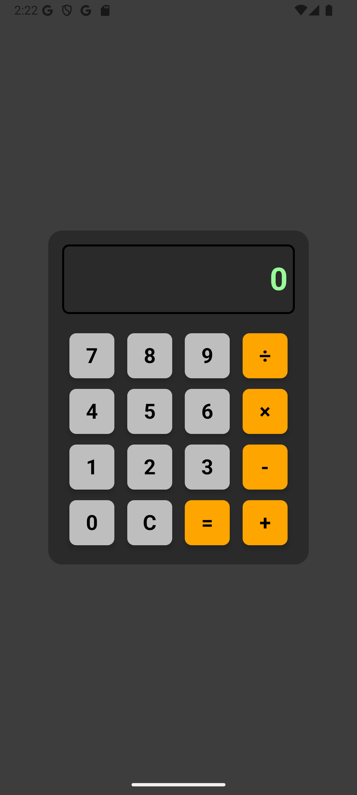

# QuickCalculator

**QuickCalculator** es una calculadora simple y eficiente diseñada para realizar operaciones matemáticas básicas de forma rápida y fácil. Esta desarrollada en Kotlin y Jetpack Compose y la arquitectura sigue un patrón MVVM para separar la lógica de negocio de la interfaz, es un código simple, modular y permite agregar nuevas funcionalidades a futuro.



---

## Características

- **Operaciones básicas**: Suma, resta, multiplicación, división y cálculo de expresiones.
- **Interfaz de usuario simple**: Estilo retro inspirado en las calculadoras de los 90.
- **Adaptativa**: Interfaz optimizada para diferentes tamaños de pantalla y dispositivos.
- **Diseño eficiente**: Utiliza la arquitectura **MVVM** para una estructura limpia y mantenible.
- **Evaluación**: Utiliza JavaScript para evaluar las expresiones matemáticas de manera eficiente.

---

## Tecnologías

- **Kotlin**: Lenguaje base para el desarrollo
- **Jetpack Compose**: Librería de UI declarativa para la interfaz de usuario.
- **MVVM**: Patrón de arquitectura.
- **JavaScript (ScriptEngineManager)**: Evaluacion de expresiones matemáticas.

---

## Instalación

Para probar la aplicación en tu dispositivo o emulador:

1. Clona el repositorio en tu máquina:
   ```bash
   git clone https://github.com/ip25-solutions/QuickCalculator.git
